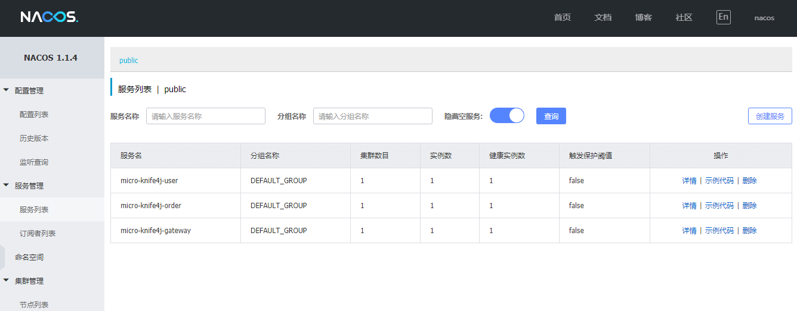
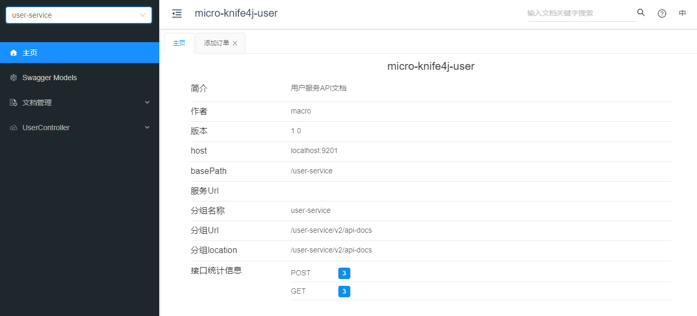
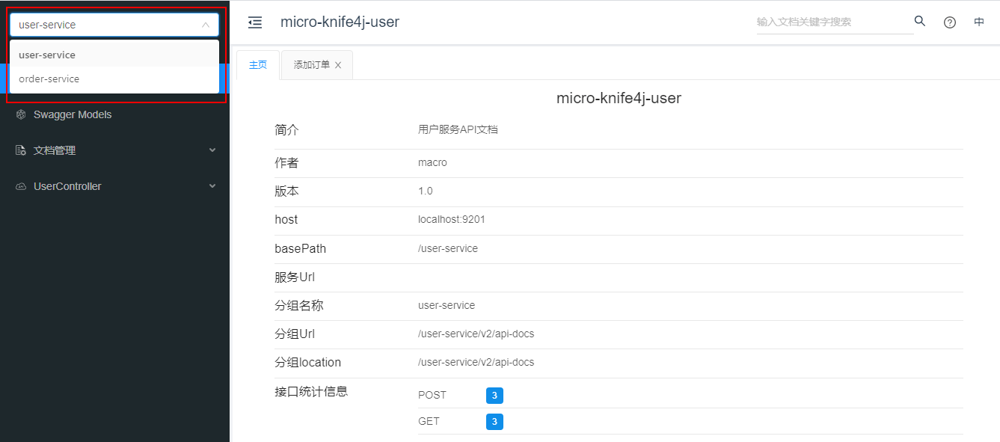
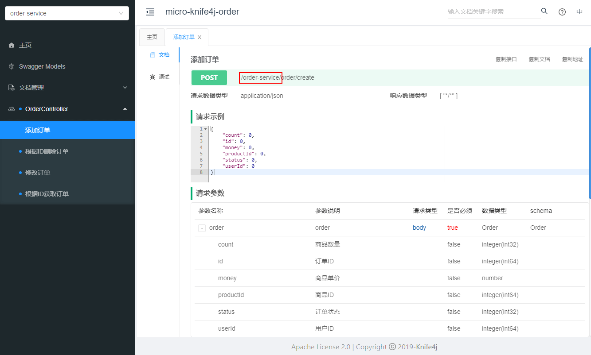
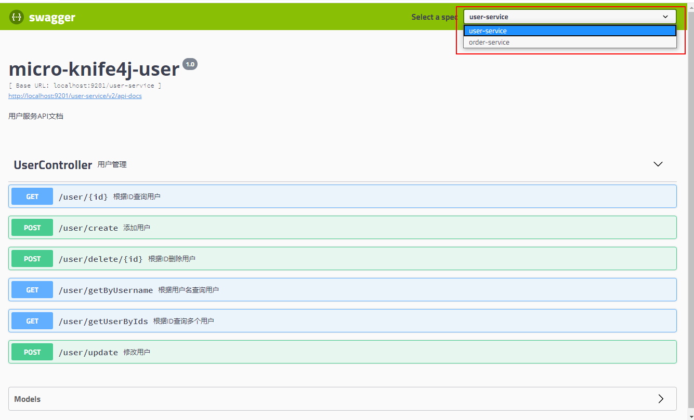

mall项目全套学习教程连载中，[关注公众号](#公众号)第一时间获取。

# 微服务聚合Swagger文档，这波操作是真的香！

> 记得我的`mall-swarm`微服务项目中，没有做API文档聚合，访问每个服务的API文档都需要访问单独的`swagger-ui.html`页面，既然我们使用了微服务，就应该有统一的API文档入口，最近发现`knife4j`有这方面的支持，本文将详细介绍其实现，希望对大家有所帮助！

## 前置知识

> 我们将采用Nacos作为注册中心，Gateway作为网关，使用`knife4j`来生成API文档，对这些技术不了解的朋友可以看下下面的文章。

- [Spring Cloud Gateway：新一代API网关服务](https://mp.weixin.qq.com/s/bTp4_M3m7rhlhC9wYKExwA)
- [Spring Cloud Alibaba：Nacos 作为注册中心和配置中心使用](https://mp.weixin.qq.com/s/N9eAMHuDEJq7kCCJPEEJqw)
- [给Swagger换了个新皮肤，瞬间高大上了！](https://mp.weixin.qq.com/s/XbBD0E136F72gI6OkVIZeA)

## 应用架构

> 我们理想的解决方案应该是这样的，网关作为API文档的统一入口，网关聚合所有微服务的文档，通过在网关进行切换来实现对其他服务API文档的访问。

相关服务划分：

- micro-knife4j-gateway：网关服务，作为微服务API文档的访问入口，聚合所有API文档，需要引入文档前端UI包；
- micro-knife4j-user：用户服务，普通API服务，不需要引入文档前端UI包；
- micro-knife4j-order：订单服务，普通API服务，不需要引入文档前端UI包。

## 具体实现

> 下面详细介绍下Spring Cloud Gateway + knife4j 聚合API文档的具体实现，依次搭建用户服务、订单服务和网关服务。

### micro-knife4j-user

> 我们首先来搭建用户服务，一个普通的API服务，很简单，仅需三步即可集成knife4j。

- 在`pom.xml`中添加相关依赖，一个SpringBoot的web功能依赖，knife4j的微服务依赖（不包含API文档的前端UI包）；

```xml
<dependencies>
    <dependency>
        <groupId>org.springframework.boot</groupId>
        <artifactId>spring-boot-starter-web</artifactId>
    </dependency>
    <dependency>
        <groupId>com.github.xiaoymin</groupId>
        <artifactId>knife4j-micro-spring-boot-starter</artifactId>
    </dependency>
</dependencies>
```

- 在`application.yml`这添加相关配置，配置一下Nacos注册中心即可；

```yaml
server:
  port: 9501
spring:
  profiles:
    active: dev
  application:
    name: micro-knife4j-user
  cloud:
    nacos:
      discovery:
        server-addr: localhost:8848
management:
  endpoints:
    web:
      exposure:
        include: "*"
```

- 添加Swagger相关配置，非常常规的配置，添加`@EnableKnife4j`注解开启knife4j的增强功能。

```java
/**
 * Swagger API相关配置
 */
@Configuration
@EnableSwagger2
@EnableKnife4j
public class Swagger2Config {
    @Bean
    public Docket createRestApi(){
        return new Docket(DocumentationType.SWAGGER_2)
                .apiInfo(apiInfo())
                .select()
                .apis(RequestHandlerSelectors.basePackage("com.macro.cloud.controller"))
                .paths(PathSelectors.any())
                .build();
    }

    private ApiInfo apiInfo() {
        return new ApiInfoBuilder()
                .title("micro-knife4j-user")
                .description("用户服务API文档")
                .contact("macro")
                .version("1.0")
                .build();
    }
}
```

### micro-knife4j-order

> 我们接下来搭建订单服务，一个普通的API服务，直接参考上面用户服务的搭建即可。

### micro-knife4j-gateway

> 最后我们搭建网关服务，作为微服务API文档的的统一入口，聚合所有微服务的API文档。

- 在`pom.xml`中添加相关依赖，Gateway相关依赖和knife4j的Starter（包含API文档的前端UI包）；

```xml
<dependencies>
    <dependency>
        <groupId>org.springframework.cloud</groupId>
        <artifactId>spring-cloud-starter-gateway</artifactId>
    </dependency>
    <dependency>
        <groupId>com.github.xiaoymin</groupId>
        <artifactId>knife4j-spring-boot-starter</artifactId>
    </dependency>
</dependencies>
```

- 在`application.yml`这添加相关配置，配置一下Nacos注册中心，用户服务和订单服务的路由即可；

```yaml
server:
  port: 9201
spring:
  profiles:
    active: dev
  application:
    name: micro-knife4j-gateway
  cloud:
    nacos:
      discovery:
        server-addr: localhost:8848
    gateway:
      routes: #配置路由路径
        - id: user-service
          uri: lb://micro-knife4j-user
          predicates:
            - Path=/user-service/**
          filters:
            - StripPrefix=1
        - id: order-service
          uri: lb://micro-knife4j-order
          predicates:
            - Path=/order-service/**
          filters:
            - StripPrefix=1
      discovery:
        locator:
          enabled: true #开启从注册中心动态创建路由的功能
          lower-case-service-id: true #使用小写服务名，默认是大写
```

- 在网关上添加Swagger资源配置，用于聚合其他微服务中Swagger的`api-docs`访问路径；

```java
/**
 * Swagger资源配置
 * Created by macro on 2020/7/9.
 */
@Slf4j
@Component
@Primary
@AllArgsConstructor
public class SwaggerResourceConfig implements SwaggerResourcesProvider {

    private final RouteLocator routeLocator;
    private final GatewayProperties gatewayProperties;

    @Override
    public List<SwaggerResource> get() {
        List<SwaggerResource> resources = new ArrayList<>();
        List<String> routes = new ArrayList<>();
        //获取所有路由的ID
        routeLocator.getRoutes().subscribe(route -> routes.add(route.getId()));
        //过滤出配置文件中定义的路由->过滤出Path Route Predicate->根据路径拼接成api-docs路径->生成SwaggerResource
        gatewayProperties.getRoutes().stream().filter(routeDefinition -> routes.contains(routeDefinition.getId())).forEach(route -> {
            route.getPredicates().stream()
                    .filter(predicateDefinition -> ("Path").equalsIgnoreCase(predicateDefinition.getName()))
                    .forEach(predicateDefinition -> resources.add(swaggerResource(route.getId(),
                            predicateDefinition.getArgs().get(NameUtils.GENERATED_NAME_PREFIX + "0")
                                    .replace("**", "v2/api-docs"))));
        });

        return resources;
    }

    private SwaggerResource swaggerResource(String name, String location) {
        log.info("name:{},location:{}", name, location);
        SwaggerResource swaggerResource = new SwaggerResource();
        swaggerResource.setName(name);
        swaggerResource.setLocation(location);
        swaggerResource.setSwaggerVersion("2.0");
        return swaggerResource;
    }
}
```

- 什么是Swagger的`api-docs`访问路径？该路径会返回JSON格式数据，Swagger渲染API文档页面的所有数据就是来源于此，比如我们的用户服务会返回如下信息，访问地址：http://localhost:9201/user-service/v2/api-docs


- 接下来我们需要自定义Swagger各个配置的节点，简单来说就是自定义Swagger内部的各个获取数据的接口；

```java
/**
 * 自定义Swagger的各个配置节点
 * Created by macro on 2020/7/9.
 */
@RestController
public class SwaggerHandler {

    @Autowired(required = false)
    private SecurityConfiguration securityConfiguration;

    @Autowired(required = false)
    private UiConfiguration uiConfiguration;

    private final SwaggerResourcesProvider swaggerResources;

    @Autowired
    public SwaggerHandler(SwaggerResourcesProvider swaggerResources) {
        this.swaggerResources = swaggerResources;
    }

    /**
     * Swagger安全配置，支持oauth和apiKey设置
     */
    @GetMapping("/swagger-resources/configuration/security")
    public Mono<ResponseEntity<SecurityConfiguration>> securityConfiguration() {
        return Mono.just(new ResponseEntity<>(
                Optional.ofNullable(securityConfiguration).orElse(SecurityConfigurationBuilder.builder().build()), HttpStatus.OK));
    }

    /**
     * Swagger UI配置
     */
    @GetMapping("/swagger-resources/configuration/ui")
    public Mono<ResponseEntity<UiConfiguration>> uiConfiguration() {
        return Mono.just(new ResponseEntity<>(
                Optional.ofNullable(uiConfiguration).orElse(UiConfigurationBuilder.builder().build()), HttpStatus.OK));
    }

    /**
     * Swagger资源配置，微服务中这各个服务的api-docs信息
     */
    @GetMapping("/swagger-resources")
    public Mono<ResponseEntity> swaggerResources() {
        return Mono.just((new ResponseEntity<>(swaggerResources.get(), HttpStatus.OK)));
    }
}
```

- 比如说`swagger-resources`这个接口，可用于获取所有微服务的`api-docs`访问路径，获取信息如下，访问地址：http://localhost:9201/swagger-resources


## 功能演示

> 接下来我们来演示下微服务API文档聚合的功能，仅需要访问网关的API文档页面即可，可自行切换到相关服务的API文档。

- 在此之前先启动我们的Nacos注册中心，然后依次启动`micro-knife4j-user`、`micro-knife4j-order`及`micro-knife4j-gateway`服务；



- 从网关访问API文档，访问地址：http://localhost:9201/doc.html



- 我们通过左上角的切换组件即可切换到对应服务的API文档；



- 查看API文档，我们可以发现所有接口都已经添加了对应的访问前缀，可以正常访问。



## 切换回Swagger UI

> 如果你不想使用knife4j的界面，想用原来的Swagger界面，也是可以支持的，切换方法非常简单，下面我们来讲讲。

- 首先我们需要在`pom.xml`中去除knife4j的相关依赖，主要就是下面两个依赖；

```xml
<dependencies>
    <dependency>
        <groupId>com.github.xiaoymin</groupId>
        <artifactId>knife4j-micro-spring-boot-starter</artifactId>
    </dependency>
    <dependency>
        <groupId>com.github.xiaoymin</groupId>
        <artifactId>knife4j-spring-boot-starter</artifactId>
    </dependency>
</dependencies>
```

- 在`pom.xml`中添加Swagger相关依赖，并去除原来使用的`@EnableKnife4j`注解；

```xml
<dependencies>
    <dependency>
        <groupId>io.springfox</groupId>
        <artifactId>springfox-swagger2</artifactId>
        <version>2.9.2</version>
    </dependency>
    <dependency>
        <groupId>io.springfox</groupId>
        <artifactId>springfox-swagger-ui</artifactId>
        <version>2.9.2</version>
    </dependency>
    <dependency>
        <groupId>io.swagger</groupId>
        <artifactId>swagger-models</artifactId>
        <version>1.6.0</version>
    </dependency>
    <dependency>
        <groupId>io.swagger</groupId>
        <artifactId>swagger-annotations</artifactId>
        <version>1.6.0</version>
    </dependency>
</dependencies>
```

- 重新启动所有服务，访问网关的API文档路径即可查看：http://localhost:9201/swagger-ui.html



## 总结

对比knife4j和原生Swagger的微服务使用，再次证明knife4j是springfox-swagger的增强UI实现，完全遵循了springfox-swagger中的使用方式。

## 参考资料

官方文档：https://doc.xiaominfo.com/guide/ui-front-gateway.html

## 项目源码地址

https://github.com/macrozheng/springcloud-learning/tree/master/micro-knife4j

## 公众号

